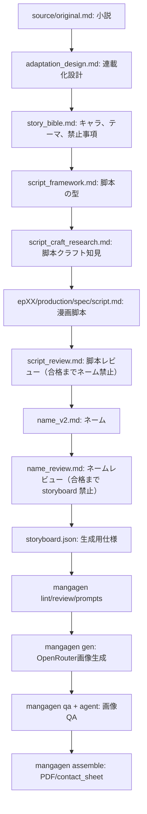

# 小説から漫画生成までの制作ワークフロー

この作品では、小説を直接 `storyboard.json` に変換しない。

必ず **小説 → 翻案設計 → 漫画脚本 → ネーム → storyboard.json → 画像生成 → QA** の順に進める。

## 全体フロー



## 1. 小説を読む

入力は `source/original.md` または原作メモ。

ここでは小説の文章をそのまま漫画に置き換えない。次を抜き出す。

- 出来事
- 主人公の自己欺瞞
- 相手の反復行動
- 会話にできる衝突
- 絵にできるモチーフ
- 省略すべき説明

## 2. 翻案設計を確認する

`manga/production/spec/adaptation_design.md` で、どの原作パートを何話に割るかを確認する。

この段階で決めること:

- 各話の開始状態と終了状態
- その話で扱う問題を1つに絞る
- 話末のヒキ
- 主要モチーフの初出と変質

## 3. Story Bible を固定する

`manga/production/spec/story_bible.md` は、全話共通の真実を持つ。

ここに反する内容を、脚本・ネーム・画像生成プロンプトへ入れてはいけない。

特にこの作品では次を固定する。

- ヒロとまけおとは両方男性。
- ヒロは眼鏡なし。
- まけおとは眼鏡なし。
- 立ち飲み屋、玄関、スポーツバッグ、スマホ通知は反復モチーフ。
- 説明セリフで横領手口を長々と説明しない。

## 4. 漫画脚本を作る

各話に `manga/epXX-*/production/spec/script.md` を作る。

脚本は `script_framework.md` の型に従う。作成前に `script_craft_research.md` を読み、漫画原作・会話劇・セリフ設計の原則を反映する。目的は、ネーム前に会話劇としての強度を作ること。

脚本で必ず書くもの:

- `episode_premise`
- `emotional_delta`
- `must_say`
- `must_not_say`
- `visual_motifs`
- `scene_blocks`
- `dialogue_ladder`
- `reaction_beats`
- `page_intent`

会話劇寄りにするため、重要場面には次の階段を置く。

```text
問い → 回避 → 押し返し → 沈黙 → 譲歩 → 余韻
```

## 5. 脚本レビューを行う

`script.md` ができたら、**ネームへ進む前に必ず**レビューする。

成果物: `production/spec/script_review.md`  
チェックリスト: `script_review_checklist.md`

判定:

- **ship**: ネームへ進める
- **revise**: 脚本を直してから再レビュー
- **blocked**: story bible / 翻案設計へ戻る

レビュー観点:

- セリフ量は漫画として足りているか。
- 重要な決断が1発話で終わっていないか。
- 各セリフに相手の反応があるか。
- 沈黙が絵で描ける形になっているか。
- 非セリフ行が caption（結果・語り）か monologue（未整理断片）か、脚本段階で分類されているか。
- 過去形・「〜ていた」は caption 候補として扱っているか（本作は monologue 原則不使用）。
- 男同士の距離感、気まずさ、敬語の揺れが出ているか。
- 各ページに次へ進む理由があるか。

**`script_review.md` の判定が ship になるまで、ネーム・storyboard.json を書かない。**

## 6. ネームを作る

**脚本レビュー（ship）を通過したら**、ページ単位・コマ単位へ変換する。

成果物: `production/spec/name_v2.md`

ネームで決めること:

- ページ配分
- コマ数
- コマの大小
- 読み順
- 吹き出し位置
- ヒキ/メクリ
- 視線誘導
- caption / monologue / sfx の分類

ネームは脚本の全セリフを機械的に載せるものではない。削る、間を作る、絵に逃がす、ページをまたがせる判断を行う。

## 6b. ネームレビューを行う

`name_v2.md` ができたら、**storyboard.json へ進む前に必ず**レビューする。

成果物: `production/spec/name_review.md`  
チェックリスト: `name_review_checklist.md`

判定:

- **ship**: storyboard 化へ進める
- **revise**: ネームを直してから再レビュー
- **blocked**: 脚本へ戻る

レビュー観点:

- 脚本の `must_say` が落ちていないか。
- 脚本にない説明セリフを勝手に追加していないか。
- 16P の起承転結と各ページのヒキが成立しているか。
- 1ページの文字量・「うん」等の反復が多すぎないか。
- caption / monologue の分類が描き分けルールと一致しているか。

**`name_review.md` の判定が ship になるまで、storyboard.json を書かない。**

## 7. `storyboard.json` に落とす

**ネームレビュー（ship）を通過したら**、ネームで決めたページ構造を `mangagen` が読める形式へ変換する。

`storyboard.json` に持たせるもの:

- キャラクター識別子
- 品質チェック
- ページ
- パネル
- `pos` スロット
- 英語の絵指定
- 正確に描画する日本語テキスト

`storyboard.json` に持たせないもの:

- 脚本上の未解決メモ
- 小説本文の長い引用
- ネーム前の会話案の候補
- 画像生成に不要な抽象論

## 8. 生成前検証

```bash
SERIES=projects/onibaku/manga/production/spec
SPEC=projects/onibaku/manga/ep01-yobimizu/production/spec/storyboard.json

# 全話一括 lint（未着手話の spec 欠落は error）
uv run python tools/mangagen.py lint --series-root $SERIES

# 話単位
uv run python tools/mangagen.py lint --spec $SPEC
uv run python tools/mangagen.py review --spec $SPEC
uv run python tools/mangagen.py prompts --spec $SPEC
```

`review` はOpenRouterを使わない。エージェントが読むためのレビュー依頼を生成するだけ。連載各話は `format: series-episode` により前話末・emotional_delta を payload に含む。

## 8b. シリーズ横断レビュー

主要話の storyboard が揃った段階で:

```bash
uv run python tools/mangagen.py series-review --series-root $SERIES
# → manga/production/output/latest/qa/series_review_request.md
# coding agent が series_review.json を作成（templates/series_review_checklist.md 参照）
```

## 9. 画像生成

画像生成だけがOpenRouterを使う。

```bash
export OPENROUTER_API_KEY=your_key_here
uv run python tools/mangagen.py gen --spec $SPEC --all-pages
```

## 10. 画像QAと組版

```bash
uv run python tools/mangagen.py qa --spec $SPEC

# coding agent が page_XX_request.md と画像を見て page_XX.json を作る

uv run python tools/mangagen.py fix --spec $SPEC
uv run python tools/mangagen.py assemble --spec $SPEC
```

`qa` もOpenRouterを使わない。画像を見たエージェントが、読み順・文字・人物同一性・手・画面の物理を判定する。

## 戻りルール

問題が見つかった場合、戻るレイヤーを間違えない。

| 問題 | 戻る場所 |
|---|---|
| 性別・設定が違う | `story_bible.md` |
| 会話が薄い | `script.md` |
| 脚本レビュー未実施でネームが進んでいる | 脚本レビューへ戻る |
| ページのヒキが弱い | ネーム |
| ネームレビュー未実施で storyboard が進んでいる | ネームレビューへ戻る |
| 読み順・コマ位置が危ない | `storyboard.json` |
| 文字化け・手の崩れ | 画像QA/fix |

今回の「女版になった」「セリフが少ない」は、画像QAだけで直す問題ではない。`story_bible.md` と `script.md` へ戻る。
